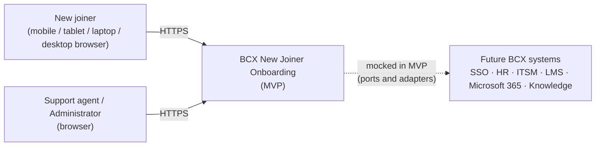
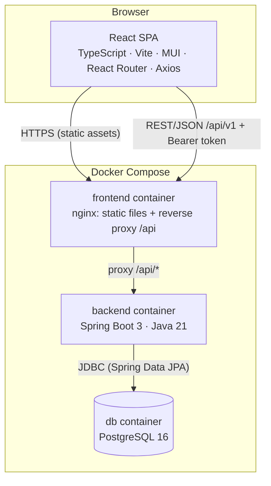
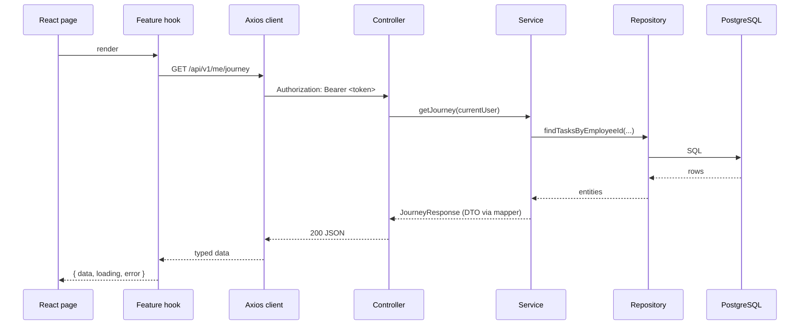
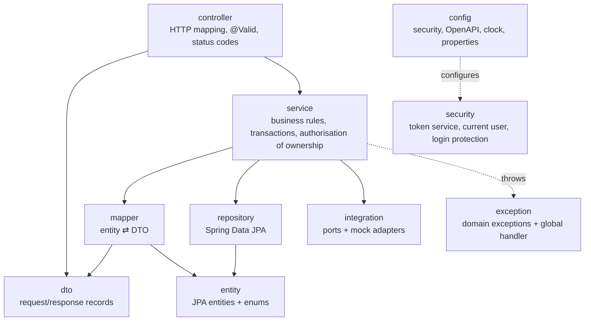
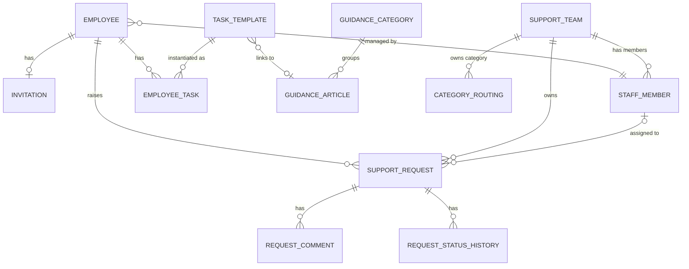
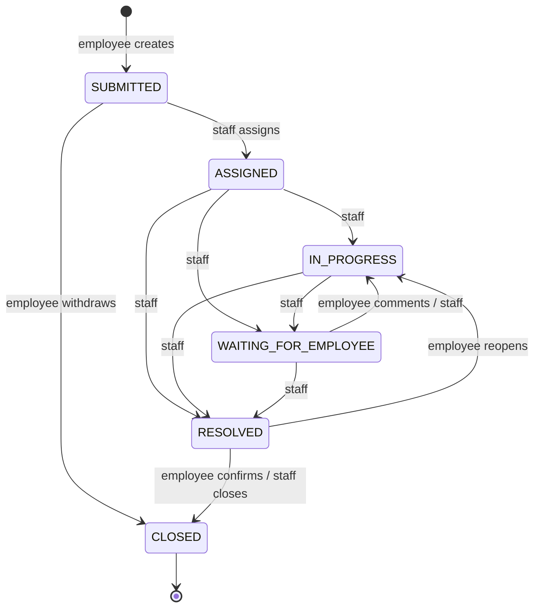
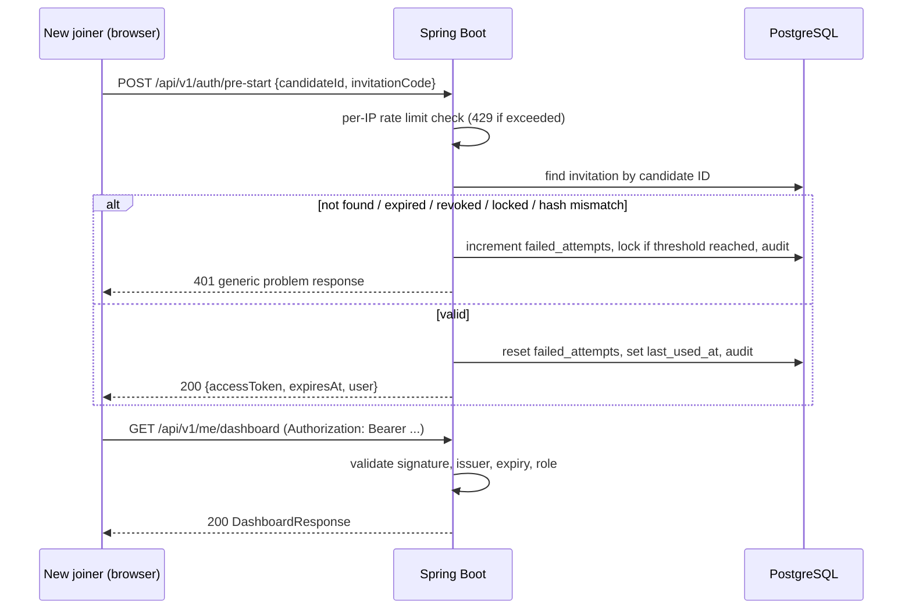
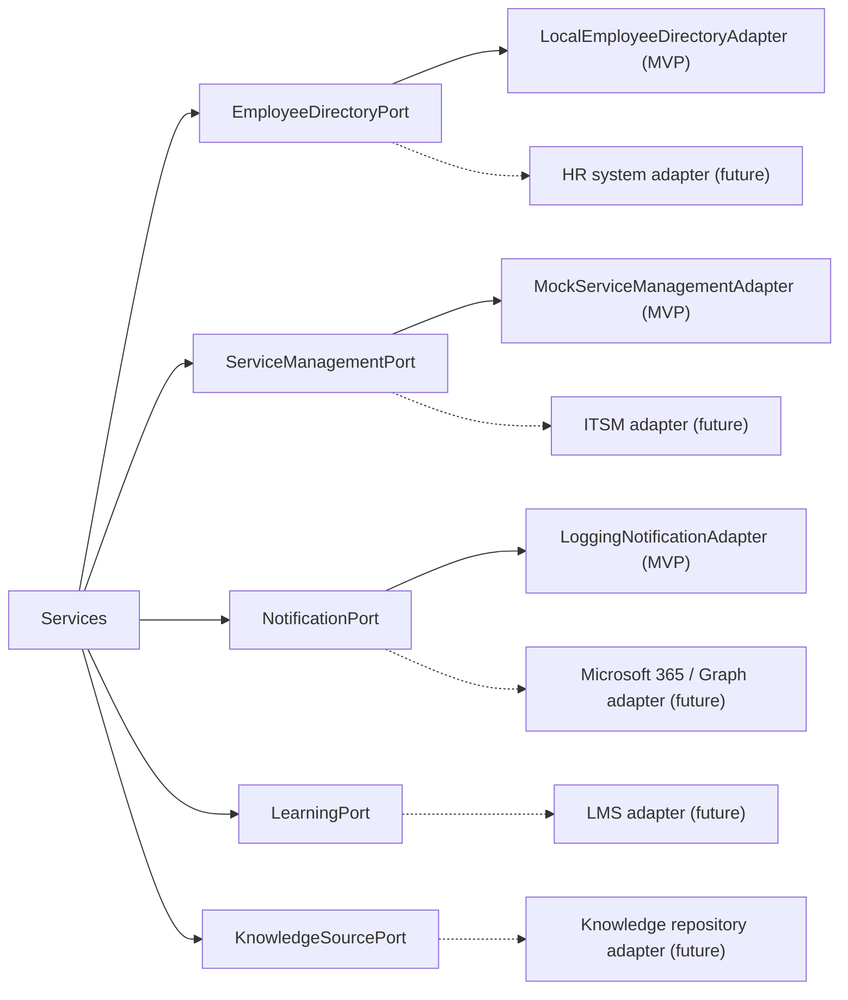

# BCX New Joiner Onboarding — Architecture

| Item | Value |
|---|---|
| Document status | Draft v1.0 — architecture baseline for the MVP |
| Owner | Lead Software Architect |
| Last updated | 07 October 2026 |
| Related | [ROADMAP.md](./ROADMAP.md) |

> **Data notice.** Every person, code, team, article and request described in this document is fictional demo data. The MVP must not contain confidential BCX information and must not connect to any real BCX system.

---

## Table of contents

1. [Business requirements](#1-business-requirements)
2. [Functional requirements](#2-functional-requirements)
3. [Non-functional requirements](#3-non-functional-requirements)
4. [User journeys](#4-user-journeys)
5. [System architecture](#5-system-architecture)
6. [Frontend architecture](#6-frontend-architecture)
7. [Backend architecture](#7-backend-architecture)
8. [Database architecture](#8-database-architecture)
9. [Security architecture](#9-security-architecture)
10. [API architecture](#10-api-architecture)
11. [Future integration architecture](#11-future-integration-architecture)
12. [Recommended project structure](#12-recommended-project-structure)
13. [Development phases](#13-development-phases)
14. [Risks](#14-risks)
15. [Assumptions](#15-assumptions)
16. [Appendix A — Demo data](#appendix-a--demo-data)
17. [Appendix B — Proposed additions to the technology stack](#appendix-b--proposed-additions-to-the-technology-stack)

---

## 1. Business requirements

### 1.1 Problem statement

A new BCX employee has no single place to go between accepting an offer and the end of their first 90 days. Before Day 1 they do not yet have a BCX account, so they cannot reach internal tools. After Day 1 the information they need is spread across many systems and people.

### 1.2 CTO requirements

| ID | Requirement |
|---|---|
| **BR-1** | A secure pre-start entry that works before a BCX account is active, using fictional/demo data for the MVP. |
| **BR-2** | A personal view of what happens before Day 1 and during the first 90 days. |
| **BR-3** | A way to find guidance about tools and ways of working. |
| **BR-4** | A way to ask for help and see who owns the request and its progress. |

### 1.3 Business goals

- Reduce new-joiner uncertainty and repeated "who do I ask?" questions.
- Give support teams a single, structured queue for new-joiner requests.
- Produce a demonstrable MVP that proves the concept and can later be connected to BCX identity, HR, ITSM, LMS, Microsoft 365 and knowledge systems without a rewrite.

### 1.4 Stakeholders and personas

| Persona | Description | Application role |
|---|---|---|
| New joiner | Sarah Mokoena, Software Engineer, starts 02 November 2026. Uses a personal phone or laptop before Day 1. | `NEW_JOINER` |
| Support agent | A fictional member of a support team (IT Service Desk, HR, etc.) who works the request queue. | `SUPPORT_AGENT` |
| Administrator | A fictional onboarding administrator who sees all teams' requests and can reassign across teams. | `ADMIN` |
| Line manager | James Smith. Shown as a contact in the MVP; does not log in. | none (MVP) |
| CTO / sponsor | Evaluates the MVP against BR-1 to BR-4. | none |

### 1.5 In scope (MVP)

The ten features: Pre-Start Entry, Welcome, Dashboard, My Journey, Guidance, Ask for Help, My Requests, Request Details, Support/Admin, Profile.

### 1.6 Out of scope (MVP)

- Any connection to real BCX systems (SSO, HR, ITSM, LMS, Microsoft 365, knowledge repositories).
- Sending real email, SMS or Teams notifications.
- File attachments on requests.
- Content management UI for guidance articles (content is seeded).
- Invitation management UI (invitations are seeded).
- Request priorities, SLAs and escalations.
- Manager and buddy log-in.
- Multi-language support (English only, but strings are kept out of business logic).
- Native mobile apps (the web app is responsive instead).

---

## 2. Functional requirements

Each requirement is traced to a business requirement. "Must" items are required for the MVP; "Should" items are delivered if time allows within the phase.

### 2.1 Pre-Start Entry (BR-1)

| ID | Requirement | Priority |
|---|---|---|
| FR-1.1 | A new joiner signs in with **Candidate ID** and **Invitation Code**, without a BCX account. | Must |
| FR-1.2 | Inputs are trimmed and case-insensitive (`bcx-new-10452` is treated as `BCX-NEW-10452`). | Must |
| FR-1.3 | A failed sign-in returns one generic message ("The Candidate ID or Invitation Code is not valid") and never reveals which field was wrong. | Must |
| FR-1.4 | After 5 consecutive failed attempts for a Candidate ID, that invitation is locked for 15 minutes (both values configurable). While locked, even the correct code is rejected with the same generic message, so a lockout does not reveal that the Candidate ID exists. | Must |
| FR-1.5 | Sign-in attempts are rate-limited per client IP address; excess attempts receive HTTP 429 with the message "Too many attempts. Please wait and try again." | Must |
| FR-1.6 | Expired or revoked invitations cannot be used. | Must |
| FR-1.7 | A successful sign-in issues a short-lived access token (default 60 minutes). | Must |
| FR-1.8 | The user can sign out; on token expiry the user is returned to the entry screen with a "session expired" message. | Must |
| FR-1.9 | Support agents and administrators sign in on a separate staff sign-in screen with a username and password (a stand-in for future BCX SSO). | Must |

### 2.2 Welcome (BR-2)

| ID | Requirement | Priority |
|---|---|---|
| FR-2.1 | On first sign-in the new joiner sees a personalised Welcome screen (name, role, business unit, start date, manager). | Must |
| FR-2.2 | The new joiner acknowledges the Welcome screen; later sign-ins go straight to the Dashboard. The Welcome screen stays reachable from the menu. | Must |

### 2.3 Dashboard (BR-2, BR-3, BR-4)

| ID | Requirement | Priority |
|---|---|---|
| FR-3.1 | Shows a countdown to Day 1 before the start date, and "Day N of 90" after it. | Must |
| FR-3.2 | Shows the current onboarding phase and overall journey progress (% of tasks completed). | Must |
| FR-3.3 | Shows the next 3 upcoming or overdue tasks. | Must |
| FR-3.4 | Shows a count of open requests and the most recently updated request. | Must |
| FR-3.5 | Shows up to 3 guidance articles recommended for the current phase. | Should |
| FR-3.6 | Shows the manager as the key contact. | Must |

All values on the dashboard are calculated by the backend.

### 2.4 My Journey (BR-2)

| ID | Requirement | Priority |
|---|---|---|
| FR-4.1 | Shows the five phases in order: `PRE_START`, `DAY_1`, `FIRST_30_DAYS`, `DAYS_31_60`, `DAYS_61_90`, each with its calendar date range for this employee. | Must |
| FR-4.2 | Marks each phase as completed, current or upcoming based on today's date. | Must |
| FR-4.3 | Lists the tasks in each phase with title, description, due date, owner (Employee, Manager, IT, HR) and status. | Must |
| FR-4.4 | The new joiner can change the status of tasks they own (`NOT_STARTED` → `IN_PROGRESS` → `COMPLETED`, and back). Tasks owned by others are read-only. | Must |
| FR-4.5 | Overdue tasks are visibly flagged. | Must |
| FR-4.6 | A task may link to a related guidance article. | Should |

### 2.5 Guidance (BR-3)

| ID | Requirement | Priority |
|---|---|---|
| FR-5.1 | Lists guidance articles grouped by category (for example Tools, Ways of Working, Security, People & HR, Getting Started). | Must |
| FR-5.2 | Free-text search across article title, summary and tags. | Must |
| FR-5.3 | Filter by category and by onboarding phase. | Must |
| FR-5.4 | Article detail page renders the article body (Markdown, sanitised). | Must |
| FR-5.5 | Each article offers an "Still need help? Ask for help" link that pre-fills the request category. | Should |

### 2.6 Ask for Help (BR-4)

| ID | Requirement | Priority |
|---|---|---|
| FR-6.1 | The new joiner creates a request with category (`ACCOUNT_ACCESS`, `LAPTOP`, `SOFTWARE`, `SECURITY`, `HR`, `ONBOARDING`, `OTHER`), subject (5–120 characters) and description (10–4000 characters). | Must |
| FR-6.2 | On submission the system generates a human-readable reference (for example `REQ-2026-000123`), sets status `SUBMITTED`, and routes the request to the owning support team for that category. | Must |
| FR-6.3 | The confirmation shows the reference, the owning team and the expected next step. | Must |

### 2.7 My Requests (BR-4)

| ID | Requirement | Priority |
|---|---|---|
| FR-7.1 | Lists only the signed-in new joiner's requests, newest activity first, paginated. | Must |
| FR-7.2 | Each row shows reference, subject, category, status, owner (team and, if assigned, the agent's name) and last update time. | Must |
| FR-7.3 | Filter by open (`SUBMITTED`, `ASSIGNED`, `IN_PROGRESS`, `WAITING_FOR_EMPLOYEE`) or closed (`RESOLVED`, `CLOSED`). | Must |

### 2.8 Request Details (BR-4)

| ID | Requirement | Priority |
|---|---|---|
| FR-8.1 | Shows full request details, current owner and current status. | Must |
| FR-8.2 | Shows a timeline that merges status changes and public comments in chronological order. | Must |
| FR-8.3 | The new joiner can add a comment. If the status is `WAITING_FOR_EMPLOYEE`, the comment moves the request back to `IN_PROGRESS`. | Must |
| FR-8.4 | The new joiner can withdraw a `SUBMITTED` request (→ `CLOSED`), confirm a `RESOLVED` request (→ `CLOSED`), or reopen a `RESOLVED` request (→ `IN_PROGRESS`). | Must |
| FR-8.5 | The backend returns the list of actions allowed for the current user; the UI shows only those actions. | Must |
| FR-8.6 | Internal staff comments are never shown to the new joiner. | Must |

### 2.9 Support/Admin (BR-4)

| ID | Requirement | Priority |
|---|---|---|
| FR-9.1 | A support agent sees the request queue for their own team; an administrator sees all teams. | Must |
| FR-9.2 | Filter the queue by status, category, assignee ("assigned to me", "unassigned") and search by reference or subject. | Must |
| FR-9.3 | Assign a request to themselves or (administrator) to any agent. Assigning a `SUBMITTED` request moves it to `ASSIGNED`. | Must |
| FR-9.4 | Change status according to the request lifecycle (section 8.5); invalid transitions are rejected. | Must |
| FR-9.5 | Add public comments (visible to the new joiner) or internal notes (staff only). | Must |
| FR-9.6 | An overview shows request counts by status and by team. | Should |

### 2.10 Profile (BR-2)

| ID | Requirement | Priority |
|---|---|---|
| FR-10.1 | Shows the new joiner's details: name, Candidate ID, role, business unit, manager, start date, personal contact email. | Must |
| FR-10.2 | Profile data is read-only in the MVP (the HR system is the future source of truth). A "Something wrong? Ask HR" link opens Ask for Help with category `HR`. | Must |
| FR-10.3 | Provides sign-out. | Must |

### 2.11 Traceability

| Business requirement | Features |
|---|---|
| BR-1 Secure pre-start entry | Pre-Start Entry, Profile (sign-out) |
| BR-2 Personal journey view | Welcome, Dashboard, My Journey, Profile |
| BR-3 Guidance | Guidance, Dashboard (recommendations), My Journey (task links) |
| BR-4 Help and request tracking | Ask for Help, My Requests, Request Details, Support/Admin, Dashboard (open requests) |

---

## 3. Non-functional requirements

| ID | Category | Requirement |
|---|---|---|
| NFR-1 | Responsiveness | Fully usable at four reference viewports: mobile 360×640, tablet 768×1024, laptop 1366×768, desktop 1920×1080. No horizontal scrolling; touch targets at least 44×44 px. |
| NFR-2 | Accessibility | WCAG 2.1 AA: keyboard navigation, visible focus, semantic landmarks, labelled form fields, colour contrast ≥ 4.5:1, status never conveyed by colour alone. |
| NFR-3 | Performance | p95 API response < 500 ms under demo load (≤ 50 concurrent users). First meaningful paint < 3 s on a mid-range phone over a fast 4G connection. Initial JavaScript bundle < 350 KB gzipped, using route-level code splitting. |
| NFR-4 | Security | See section 9. OWASP Top 10 and OWASP ASVS Level 1 controls as the baseline. |
| NFR-5 | Privacy | Collect only the personal data needed. No personal data or codes in logs. Design must be ready for South Africa's POPIA once real data is used. |
| NFR-6 | Configuration | All environment-specific values and secrets come from environment variables (twelve-factor). No secrets in the repository. |
| NFR-7 | Maintainability | Layered backend, feature-oriented frontend, consistent naming, linting and formatting enforced in CI. |
| NFR-8 | Testability | Service-layer line coverage ≥ 80%. Every API endpoint has at least one web-layer test, including security (401/403). Critical frontend flows have React Testing Library tests. |
| NFR-9 | Observability | Structured logs with a correlation ID per request (`X-Correlation-Id`), health endpoint for container health checks. |
| NFR-10 | Portability | The whole system starts with one command: `docker compose up`. |
| NFR-11 | Extensibility | Every future external system sits behind an interface (port) with a mock implementation selected by configuration (section 11). |
| NFR-12 | Browser support | Latest two versions of Chrome, Edge, Firefox and Safari; iOS Safari 16+; Android Chrome. |
| NFR-13 | Time and locale | Business dates use time zone `Africa/Johannesburg`. Timestamps are stored in UTC. Dates display as `02 November 2026`. |
| NFR-14 | Demonstrability | The demo date can be overridden by configuration so every onboarding phase can be shown without waiting (section 7.7). |

---

## 4. User journeys

### UJ-1 First access before Day 1 (BR-1, BR-2)

1. Sarah receives a (fictional) invitation email containing her Candidate ID `BCX-NEW-10452` and Invitation Code `BCX-10452`.
2. She opens the app on her personal phone and lands on **Pre-Start Entry**.
3. She enters both values. The backend validates them and returns an access token.
4. Because this is her first sign-in, she sees **Welcome**: "Welcome to BCX, Sarah. You start as a Software Engineer in Technology on 02 November 2026. Your manager is James Smith."
5. She selects **Continue** and arrives at the **Dashboard**, which shows "26 days until Day 1" (on 07 October 2026), the current phase `PRE_START`, and her next tasks.

### UJ-2 Following the journey (BR-2)

1. From the Dashboard Sarah opens **My Journey**.
2. She sees the five phases with date ranges; `PRE_START` is marked as current.
3. She opens the task "Read the new joiner welcome pack", reads the linked guidance article, and marks the task `COMPLETED`.
4. The Dashboard progress percentage increases.

### UJ-3 Finding guidance (BR-3)

1. Sarah opens **Guidance** and searches for "MFA".
2. She filters by category **Security** and opens "Setting up multi-factor authentication on Day 1".
3. The article does not answer her question, so she selects **Ask for help**, which opens the form with category `SECURITY` pre-filled.

### UJ-4 Asking for help (BR-4)

1. Sarah opens **Ask for Help**, chooses `LAPTOP`, and enters the subject "Laptop collection on Day 1" and a description.
2. She submits. The confirmation shows reference `REQ-2026-000004`, status `SUBMITTED`, and owner "End User Computing team".
3. The request appears at the top of **My Requests**.

### UJ-5 Support resolves the request (BR-4)

1. Support agent Lerato Dlamini (End User Computing) signs in on the staff sign-in screen and opens **Support/Admin**.
2. She filters "Unassigned", opens `REQ-2026-000004`, and assigns it to herself → `ASSIGNED`.
3. She moves it to `IN_PROGRESS`, then to `WAITING_FOR_EMPLOYEE` with the public comment "Which site will you work from on Day 1?".
4. Sarah sees the new status and comment in **Request Details**, and replies. The request returns to `IN_PROGRESS` automatically.
5. Lerato sets `RESOLVED` with a comment. Sarah confirms the resolution → `CLOSED`.
6. At every step, Sarah can see who owns the request and its full timeline.

### UJ-6 Failed and locked entry (BR-1)

1. Someone enters `BCX-NEW-10452` with a wrong code. They see the generic error and no hint about which field was wrong.
2. After the fifth consecutive failure, the invitation is locked for 15 minutes. Further attempts, even with the correct code, get the same generic message.
3. If the same device keeps trying, the per-IP rate limit answers with HTTP 429: "Too many attempts. Please wait and try again."
4. A security audit event is recorded for each failure and for the lockout.

### UJ-7 Session expiry (BR-1)

1. Sarah leaves the app open for longer than the token lifetime.
2. Her next action receives HTTP 401. The frontend clears the session and returns her to Pre-Start Entry with "Your session has expired. Please sign in again."

---

## 5. System architecture

### 5.1 Context



### 5.2 Containers



Key decisions:

| Decision | Choice | Reason |
|---|---|---|
| Overall style | Modular monolith: one Spring Boot service, one database | Smallest thing that meets the requirements; modules map to features so they can be split later if ever needed. |
| Client | Single-page application with responsive layout | One codebase for all four device classes (NFR-1). |
| API style | REST, JSON, versioned under `/api/v1` | Fits the required stack and is easy to document with OpenAPI. |
| Origin | nginx serves the SPA and proxies `/api` to the backend | Same origin in Docker Compose, so no CORS is needed there; CORS stays configurable for local development. |
| Authentication | Stateless signed JWT bearer tokens (Spring Security OAuth2 Resource Server) | No server sessions; the same validation code can later point at BCX SSO (section 11). |
| Integrations | Ports and adapters with mock adapters | Real BCX systems can be added without changing services or controllers. |

### 5.3 Request flow (typical read)



---

## 6. Frontend architecture

### 6.1 Principles

1. **Components render, hooks decide.** Pages and components only display data and raise events. Data fetching, state, and orchestration live in feature hooks. Business rules (phase calculation, progress, allowed request actions, routing to teams) live in the backend.
2. **Feature-oriented folders.** Each feature owns its pages, components, hooks, API calls and types. Shared code lives in `shared/` only when two or more features use it.
3. **One HTTP client.** A single Axios instance handles the base URL, the bearer token, the correlation ID, and error normalisation.
4. **Typed contracts.** TypeScript types mirror the backend DTOs one-to-one.
5. **Accessible and responsive by default** using MUI components, the theme, and breakpoints.

### 6.2 Layers inside the frontend

| Layer | Responsibility | Example |
|---|---|---|
| Page | Route entry point; composes components; reads one or more hooks. | `MyRequestsPage.tsx` |
| Component | Presentational, props in / events out, no API calls. | `RequestStatusChip.tsx` |
| Hook | Loading/error state, calls the feature API module, exposes actions. | `useMyRequests()` |
| Feature API module | Thin typed functions over the shared Axios client. | `requestsApi.getMyRequests(params)` |
| Shared HTTP client | Axios instance and interceptors. | `shared/api/httpClient.ts` |
| Types | DTO mirrors and UI-only types. | `features/requests/types.ts` |

No extra state-management library is used. Authentication state lives in a React context (`AuthProvider`); all other server data is fetched by feature hooks. If caching needs grow, TanStack Query can replace the hand-written hooks without changing pages (see Appendix B).

### 6.3 Routing

| Path | Page | Access |
|---|---|---|
| `/` | Redirect to `/dashboard`, `/support` or `/pre-start` depending on session and role | Public |
| `/pre-start` | Pre-Start Entry | Public |
| `/staff/sign-in` | Staff sign-in | Public |
| `/welcome` | Welcome | `NEW_JOINER` |
| `/dashboard` | Dashboard | `NEW_JOINER` |
| `/journey` | My Journey | `NEW_JOINER` |
| `/guidance` | Guidance list and search | `NEW_JOINER` |
| `/guidance/:slug` | Guidance article | `NEW_JOINER` |
| `/help/new` | Ask for Help (supports `?category=`) | `NEW_JOINER` |
| `/requests` | My Requests | `NEW_JOINER` |
| `/requests/:requestId` | Request Details | `NEW_JOINER` |
| `/support` | Support queue and overview | `SUPPORT_AGENT`, `ADMIN` |
| `/support/requests/:requestId` | Support request details | `SUPPORT_AGENT`, `ADMIN` |
| `/profile` | Profile | `NEW_JOINER` |
| `/forbidden`, `*` | 403 and 404 pages | Public |

Route guards: `RequireAuth` (has a valid session) and `RequireRole` (has one of the listed roles). Guards improve the user experience only; the backend enforces all authorisation. Feature pages are lazy-loaded with `React.lazy` for code splitting.

### 6.4 Responsive layout

One `AppShell` adapts by MUI breakpoint:

| Device | MUI breakpoint | Navigation | Content |
|---|---|---|---|
| Mobile | `xs` (< 600 px) | Top app bar + bottom navigation (Dashboard, Journey, Guidance, Requests, Profile); "Ask for help" as a floating action button | Single column, cards stacked |
| Tablet | `sm` (600–899 px) | Top app bar + navigation drawer opened from a menu button | One or two columns |
| Laptop | `md`–`lg` (900–1535 px) | Permanent side navigation | Two-column dashboard grid |
| Desktop | `xl` (≥ 1536 px) | Permanent side navigation | Content constrained to a maximum width of 1440 px, three-column dashboard grid |

The support queue shows a data table on `md` and wider, and a card list on smaller screens.

### 6.5 Cross-cutting frontend concerns

| Concern | Approach |
|---|---|
| Theme | One MUI theme (`shared/theme`) with fictional neutral branding. No real BCX logos or brand assets. |
| Authentication storage | Access token kept in memory and mirrored to `sessionStorage` so a page refresh keeps the session; cleared on sign-out, on 401, and when the tab closes. See section 9.4 for the trade-off. |
| Error handling | The Axios interceptor converts RFC 7807 problem responses into an `ApiError` type. 401 → clear session and redirect; 403 → `/forbidden`; validation errors map to form fields. |
| Loading and empty states | Shared `LoadingState`, `EmptyState`, `ErrorState` components used by every page. |
| Forms | Controlled MUI inputs with client-side checks that mirror backend limits for fast feedback; the backend remains authoritative. |
| Dates | Formatted with `Intl.DateTimeFormat('en-ZA', { timeZone: 'Africa/Johannesburg' })` in one shared utility. |
| Markdown | Guidance bodies rendered with a Markdown renderer that does not allow raw HTML (Appendix B). |
| Configuration | `VITE_API_BASE_URL` (default `/api/v1`). No secrets in the frontend. |
| Testing | Vitest + React Testing Library + `@testing-library/user-event`; API modules mocked at the module boundary. |

---

## 7. Backend architecture

### 7.1 Layers



| Package | Responsibility | Rules |
|---|---|---|
| `controller` | REST endpoints, input validation with `@Valid`, HTTP status codes, OpenAPI annotations. | No business logic; never returns entities; calls one service method per endpoint. |
| `service` | Use cases and business rules: phase calculation, task status changes, request lifecycle, routing, ownership checks. Owns transactions (`@Transactional`). | No HTTP types (`HttpServletRequest`, `ResponseEntity`). |
| `repository` | Spring Data JPA interfaces and query methods. | No business logic. |
| `entity` | JPA entities and enums (`OnboardingPhase`, `SupportRequestStatus`, `SupportCategory`, ...). | Not used outside `service`, `repository` and `mapper`. |
| `dto` | Java `record` request and response types, with Bean Validation annotations on request DTOs. | Sub-packages `dto.request` and `dto.response`. |
| `mapper` | Hand-written mapper components converting entities to DTOs and back. | Pure functions; no repository calls. |
| `exception` | Domain exceptions and `GlobalExceptionHandler` (`@RestControllerAdvice`) returning RFC 7807 `ProblemDetail`. | One place for error-to-status mapping. |
| `config` | Spring Security filter chain, CORS, OpenAPI, `Clock`, `@ConfigurationProperties` classes. | Values come from environment variables. |
| `security` | JWT issuing, current-user resolution, login-attempt protection, rate limiting. | Added alongside the required packages because security code is neither configuration nor business logic. |
| `integration` | Interfaces (ports) for future external systems and their mock adapters. | Added alongside the required packages; see section 11. |
| `seed` | Demo data loader, active only with the `demo` profile. | Never active in `prod`. |

The required packages (`controller`, `service`, `repository`, `entity`, `dto`, `mapper`, `exception`, `config`) are all used. `security`, `integration` and `seed` are additions with a single, clear purpose each.

### 7.2 Services

| Service | Responsibilities |
|---|---|
| `PreStartAuthService` | Validate Candidate ID + Invitation Code, lockout, audit, issue token. |
| `StaffAuthService` | Validate staff username + password, issue token. |
| `EmployeeProfileService` | Profile and welcome acknowledgement. Reads through `EmployeeDirectoryPort`. |
| `JourneyService` | Phase date ranges, current phase, task listing, task status change, progress. |
| `DashboardService` | Aggregates journey, requests and guidance into one dashboard response. |
| `GuidanceService` | Article search, filtering, detail, phase recommendations. |
| `SupportRequestService` | Create, list and read requests for the new joiner; comments; employee-side transitions. |
| `SupportQueueService` | Staff queue, assignment, staff-side transitions, internal notes, overview counts. |
| `RequestLifecyclePolicy` | Single source of truth for allowed status transitions per role (section 8.5). |
| `RequestRoutingService` | Category → owning team using the `category_routing` table. |
| `AuditService` | Writes security and business audit events. |

### 7.3 Phase calculation

The backend calculates phases from the employee's start date and today's date (`Clock`, zone `Africa/Johannesburg`). Day 1 is the start date; `dayNumber = (today − startDate) + 1`.

| Phase | Day numbers | Dates for Sarah |
|---|---|---|
| `PRE_START` | ≤ 0 | up to 01 November 2026 |
| `DAY_1` | 1 | 02 November 2026 |
| `FIRST_30_DAYS` | 2–30 | 03 November – 01 December 2026 |
| `DAYS_31_60` | 31–60 | 02 December 2026 – 31 December 2026 |
| `DAYS_61_90` | 61–90 | 01 January – 30 January 2027 |
| Journey complete | > 90 | from 31 January 2027 |

`OnboardingPhase` is a Java enum holding each phase's order and day range. The frontend receives the calculated dates; it does not calculate phases itself.

### 7.4 Transactions and concurrency

- Service methods that write are `@Transactional`; read methods use `@Transactional(readOnly = true)`.
- `support_request` and `employee_task` use optimistic locking (`@Version`). A concurrent update returns HTTP 409.
- `spring.jpa.open-in-view=false`; mappers run inside the service transaction.

### 7.5 Error handling

All errors use RFC 7807 `application/problem+json`:

```json
{
  "type": "https://onboarding.example/problems/validation-error",
  "title": "Validation failed",
  "status": 400,
  "detail": "One or more fields are invalid.",
  "instance": "/api/v1/requests",
  "correlationId": "5f1c2d0e-8a8b-4b8e-9d55-2b8f9e0a7c11",
  "errors": [
    { "field": "subject", "message": "must be between 5 and 120 characters" }
  ]
}
```

| Exception | HTTP status |
|---|---|
| `MethodArgumentNotValidException`, `ConstraintViolationException`, malformed JSON | 400 Bad Request |
| `InvalidCredentialsException` | 401 Unauthorized (generic message) |
| `InvitationLockedException` | 401 Unauthorized (same generic message as invalid credentials) |
| `AccessDeniedException` (wrong role) | 403 Forbidden |
| `ResourceNotFoundException` (including another user's resource) | 404 Not Found |
| `InvalidStatusTransitionException`, `OptimisticLockException` | 409 Conflict |
| `TooManyRequestsException` (rate limit) | 429 Too Many Requests, with `Retry-After` |
| Any other exception | 500 Internal Server Error (no stack trace or internal detail in the body; full detail in the log with the correlation ID) |

`type` URIs use the placeholder domain `onboarding.example`.

### 7.6 Configuration and profiles

| Profile | Purpose |
|---|---|
| `local` | Developer machine, PostgreSQL in Docker, Swagger UI on, CORS for `http://localhost:5173`, demo date override allowed. |
| `demo` | Docker Compose demo; demo seed data on; Swagger UI on; demo date override allowed. |
| `test` | Automated tests with Testcontainers PostgreSQL. |
| `prod` | Template for a real deployment; seed off; Swagger UI off; demo date override ignored. |

Environment variables (documented in `.env.example`, real `.env` is git-ignored):

| Variable | Purpose | Example (demo only) |
|---|---|---|
| `SPRING_PROFILES_ACTIVE` | Active profile | `demo` |
| `DB_URL` | JDBC URL | `jdbc:postgresql://db:5432/onboarding` |
| `DB_USERNAME` / `DB_PASSWORD` | Database credentials | set in `.env` |
| `JWT_SECRET` | HMAC signing key, at least 256 bits, Base64 | set in `.env` |
| `JWT_ISSUER` | Token issuer claim | `bcx-onboarding-mvp` |
| `JWT_TTL_MINUTES` | Access token lifetime | `60` |
| `CORS_ALLOWED_ORIGINS` | Comma-separated allowed origins | `http://localhost:5173` |
| `LOGIN_MAX_FAILED_ATTEMPTS` | Lockout threshold | `5` |
| `LOGIN_LOCKOUT_MINUTES` | Lockout duration | `15` |
| `LOGIN_RATE_LIMIT_PER_MINUTE` | Per-IP sign-in attempts per minute | `10` |
| `SWAGGER_ENABLED` | Expose Swagger UI | `true` |
| `DEMO_SEED_ENABLED` | Load demo data | `true` |
| `DEMO_INVITATION_CODE` | Demo invitation code (hashed at seed time) | `BCX-10452` |
| `DEMO_STAFF_PASSWORD` | Password for demo staff accounts (hashed at seed time) | set in `.env` |
| `APP_DEMO_DATE` | Optional fixed "today" for demos, `YYYY-MM-DD` | empty |
| `INTEGRATION_*_MODE` | Adapter selection per integration | `mock` |
| `VITE_API_BASE_URL` | Frontend API base URL (build time) | `/api/v1` |

The application fails to start if `JWT_SECRET` is missing or shorter than 256 bits.

### 7.7 Demo clock

A single `java.time.Clock` bean is injected into every service that needs "today". In the `demo` and `local` profiles, `APP_DEMO_DATE` fixes the date (for example `2026-11-02` to show Day 1, or `2026-12-15` to show `DAYS_31_60`). In `prod` the system clock is always used.

### 7.8 Backend testing strategy

| Level | Tooling | Scope |
|---|---|---|
| Unit | JUnit 5 + Mockito | Services, `RequestLifecyclePolicy`, phase calculation, mappers. |
| Web slice | `@WebMvcTest` + Spring Security test support | Controllers: validation (400), authentication (401), roles (403), status codes, JSON shape. |
| Repository | `@DataJpaTest` + Testcontainers PostgreSQL | Custom queries, constraints, Flyway migrations. |
| Integration | `@SpringBootTest` + Testcontainers | End-to-end API flows: sign-in → create request → staff resolves → employee closes; a second test employee proves one new joiner cannot see another's data. |

---

## 8. Database architecture

### 8.1 Conventions

- PostgreSQL 16. Schema managed by Flyway migrations (`V1__init.sql`, ...); Hibernate `ddl-auto=validate`.
- Primary keys are `UUID` (`gen_random_uuid()`).
- Enums stored as `VARCHAR` with `CHECK` constraints, mapped with `@Enumerated(EnumType.STRING)`. This is easier to evolve than PostgreSQL enum types.
- Timestamps are `TIMESTAMPTZ` in UTC; business dates (start date, due date) are `DATE`.
- Every table has `created_at` and `updated_at`; mutable aggregates have `version` for optimistic locking.
- `snake_case` table and column names; singular table names.
- Columns named `external_ref` are reserved for IDs in future external systems (HR, ITSM, LMS).

### 8.2 Entity relationship diagram



### 8.3 Tables

| Table | Key columns | Notes |
|---|---|---|
| `employee` | `id`, `candidate_id` (unique), `first_name`, `last_name`, `personal_email`, `job_title`, `business_unit`, `manager_id` → `staff_member`, `start_date`, `welcome_acknowledged_at`, `external_ref` | The new joiner. |
| `invitation` | `id`, `employee_id` (unique), `code_hash` (BCrypt), `status` (`ACTIVE`, `REVOKED`), `expires_at`, `failed_attempts`, `locked_until`, `last_used_at` | Never stores the plain invitation code. An invitation is usable only if `status = ACTIVE` and `expires_at` is in the future. |
| `staff_member` | `id`, `display_name`, `email`, `username` (unique, nullable), `password_hash` (nullable), `role` (`SUPPORT_AGENT`, `ADMIN`, `MANAGER`), `team_id` → `support_team` (nullable), `active` | Managers have no username/password and cannot sign in in the MVP. |
| `support_team` | `id`, `code` (unique), `name`, `description` | For example IT Service Desk, End User Computing. |
| `category_routing` | `category` (PK), `team_id` → `support_team` | One owning team per support category. |
| `task_template` | `id`, `phase`, `title`, `description`, `owner_type` (`EMPLOYEE`, `MANAGER`, `IT`, `HR`), `day_offset`, `mandatory`, `sort_order`, `guidance_article_id` (nullable) | Reusable journey definition. `day_offset` is relative to the start date (negative = before Day 1). |
| `employee_task` | `id`, `employee_id`, `task_template_id`, `due_date`, `status` (`NOT_STARTED`, `IN_PROGRESS`, `COMPLETED`), `completed_at`, `version` | A template instantiated for one employee. Unique (`employee_id`, `task_template_id`). |
| `guidance_category` | `id`, `code` (unique), `name`, `sort_order` | |
| `guidance_article` | `id`, `slug` (unique), `title`, `summary`, `body_markdown`, `category_id`, `tags` (`TEXT[]`), `relevant_phases` (`TEXT[]`), `published`, `external_ref` | Searched with `ILIKE` on title, summary and tags in the MVP; full-text search later. |
| `support_request` | `id`, `reference` (unique, from a sequence), `employee_id`, `category`, `subject`, `description`, `status`, `owning_team_id`, `assignee_id` (nullable) → `staff_member`, `resolved_at`, `closed_at`, `external_ref`, `version` | |
| `request_comment` | `id`, `request_id`, `author_type` (`EMPLOYEE`, `STAFF`), `author_id`, `body`, `internal` (boolean) | `internal = true` is never returned to new joiners. |
| `request_status_history` | `id`, `request_id`, `from_status` (nullable), `to_status`, `changed_by_type` (`EMPLOYEE`, `STAFF`, `SYSTEM`), `changed_by_id`, `note`, `changed_at` | Append-only. The first row records creation with `from_status = NULL`. |
| `audit_event` | `id`, `event_type`, `actor_type`, `actor_id` (nullable), `ip_hash`, `details` (`JSONB`), `occurred_at` | Security and business audit: sign-in success/failure, lockout, status changes. No codes, passwords or tokens. IP addresses are stored hashed. |

### 8.4 Indexes

| Index | Purpose |
|---|---|
| `support_request (employee_id, updated_at DESC)` | My Requests list. |
| `support_request (owning_team_id, status)` | Support queue. |
| `support_request (assignee_id, status)` | "Assigned to me". |
| `employee_task (employee_id, due_date)` | Journey and dashboard next tasks. |
| `guidance_article (category_id) WHERE published` | Guidance list. |
| `request_comment (request_id, created_at)`, `request_status_history (request_id, changed_at)` | Timeline. |

Unique constraints (`candidate_id`, `username`, `slug`, `reference`) also act as indexes.

### 8.5 Support request lifecycle



Rules:

- `RequestLifecyclePolicy` is the only place that knows these transitions. Any other transition returns HTTP 409.
- Moving to `ASSIGNED`, `IN_PROGRESS`, `WAITING_FOR_EMPLOYEE` or `RESOLVED` requires an assignee; assigning a `SUBMITTED` request moves it to `ASSIGNED` automatically. Reassigning a request in any other open status keeps its status.
- Moving to `WAITING_FOR_EMPLOYEE` or `RESOLVED` requires a public comment, so the new joiner always knows why.
- Every transition writes a `request_status_history` row and an `audit_event`.
- `CLOSED` is final; a new request must be created instead.
- "Open" means `SUBMITTED`, `ASSIGNED`, `IN_PROGRESS` or `WAITING_FOR_EMPLOYEE`.

### 8.6 Data seeding

| What | How | When |
|---|---|---|
| Reference data: support teams, category routing, guidance categories, guidance articles, task templates | Flyway migrations in `db/migration` | Every environment |
| Demo people and credentials: Sarah, James Smith, demo staff, Sarah's invitation, Sarah's tasks, sample requests | `seed.DemoDataSeeder` (Java, `@Profile("demo")`, idempotent) | `demo` profile only |

The Java seeder hashes `DEMO_INVITATION_CODE` and `DEMO_STAFF_PASSWORD` at start-up with the application's `PasswordEncoder`, so no hashes or plain secrets are committed. It also calculates task due dates from the start date. Full demo data is in Appendix A.

---

## 9. Security architecture

### 9.1 Threat summary

| Threat | Control |
|---|---|
| Guessing invitation codes | Generic errors, per-invitation lockout, per-IP rate limit, BCrypt hashes, audit events. |
| Stolen or leaked invitation code | Code expiry; revocation (`status = REVOKED`); short token lifetime; production would add a second factor (section 11.2). |
| Accessing another person's data | Identity is always taken from the token, never from a request parameter. Services check ownership and return 404 for resources the user does not own. |
| Privilege escalation | Role checks with `@PreAuthorize` on every staff endpoint; agents limited to their own team's queue in the service layer. |
| Token tampering | HMAC-SHA256 signature, issuer and expiry checked by Spring Security's JWT decoder. |
| Cross-site scripting (XSS) | React output escaping; Markdown rendered without raw HTML; strict Content Security Policy from nginx. |
| Cross-site request forgery (CSRF) | Not applicable: tokens are sent in the `Authorization` header, never in cookies. CSRF protection is disabled for that reason only. |
| Injection | JPA parameter binding only; no string-built SQL. |
| Secrets in source control | Environment variables only; `.env` git-ignored; `.env.example` with placeholders; start-up check on `JWT_SECRET`. |
| Sensitive data in logs | Log filter and code review rule: never log codes, passwords, tokens, or request bodies of authentication endpoints. |
| Information leakage in errors | Generic 500 responses; stack traces only in server logs. |

### 9.2 Authentication



- When the Candidate ID does not exist, the service still performs a BCrypt comparison against a dummy hash so that the response time does not reveal whether the ID exists.
- Staff sign-in (`POST /api/v1/auth/staff`) follows the same pattern with username and BCrypt password hash.
- Tokens are issued with Spring Security's `NimbusJwtEncoder` and validated by the OAuth2 Resource Server support. Claims: `sub` (employee or staff UUID), `iss`, `iat`, `exp`, `roles`, `principal_type` (`EMPLOYEE` or `STAFF`), `name`.
- No refresh tokens in the MVP. After expiry the user signs in again.
- Sign-out is client-side (the token is discarded). Server-side revocation is a future enhancement (section 14).

### 9.3 Authorisation

| Role | Can access |
|---|---|
| `NEW_JOINER` | `/api/v1/me/**`, `/api/v1/guidance/**`, `/api/v1/requests/**` (own requests only) |
| `SUPPORT_AGENT` | `/api/v1/support/**` for requests owned by their team |
| `ADMIN` | `/api/v1/support/**` for all teams, plus cross-team reassignment and the overview |
| Anonymous | `POST /api/v1/auth/**`, `GET /actuator/health`, Swagger UI and `/v3/api-docs` when `SWAGGER_ENABLED=true` |

Authorisation is enforced in two layers: URL rules in the security filter chain (by role), and ownership/team checks inside services.

### 9.4 Token storage trade-off

The access token is kept in memory and in `sessionStorage`. This is simple and avoids CSRF, but a successful XSS attack could read it. Mitigations are a strict Content Security Policy, no raw HTML rendering, a 60-minute lifetime, and dependency scanning. When BCX SSO is introduced, the recommended target is a backend-for-frontend pattern with `HttpOnly`, `Secure`, `SameSite=Strict` cookies (section 11).

### 9.5 Transport and headers

- HTTPS is required in any deployed environment (terminated at the load balancer or nginx). Local Docker Compose uses HTTP on `localhost` only.
- nginx sets `Content-Security-Policy`, `X-Content-Type-Options: nosniff`, `Referrer-Policy: no-referrer`, `X-Frame-Options: DENY`, and `Strict-Transport-Security` when served over HTTPS.
- CORS allows only origins listed in `CORS_ALLOWED_ORIGINS`.

### 9.6 Rate limiting and lockout

- Per-invitation lockout is stored in the database (`failed_attempts`, `locked_until`), so it survives restarts.
- Per-IP rate limiting uses a small in-memory fixed-window counter in the `security` package. This is enough for a single-instance MVP; with more than one instance it moves to the API gateway or a shared store (section 14).

### 9.7 Supply chain and containers

- Dependency vulnerability scanning in CI (GitHub Dependabot alerts and `npm audit`).
- Containers run as a non-root user, on minimal base images (`eclipse-temurin:21-jre`, `nginx:alpine`, `postgres:16-alpine`).
- The database port is not published outside the Docker network in the `demo` setup.

---

## 10. API architecture

### 10.1 Conventions

| Topic | Convention |
|---|---|
| Base path | `/api/v1` |
| Format | JSON, `camelCase` fields, ISO-8601 dates (`2026-11-02`) and UTC timestamps (`2026-10-07T06:33:00Z`). |
| Identifiers | UUIDs in URLs; the human-readable `reference` is for display and search only. |
| Pagination | `?page=0&size=20&sort=updatedAt,desc`; maximum `size` 100. Response wrapper: `{ content, page, size, totalElements, totalPages }`. |
| Creation | `201 Created` with a `Location` header and the created resource in the body. |
| Updates without a body to return | `204 No Content`. |
| Errors | RFC 7807 problem details (section 7.5). |
| Correlation | `X-Correlation-Id` accepted from the client or generated; returned on every response and written to every log line. |
| Documentation | springdoc-openapi: `/v3/api-docs` and `/swagger-ui.html` (only when `SWAGGER_ENABLED=true`). |
| Versioning | Breaking changes go to `/api/v2`; additive changes stay in `v1`. |

### 10.2 Endpoints

**Authentication (anonymous)**

| Method | Path | Body | Success | Errors |
|---|---|---|---|---|
| POST | `/auth/pre-start` | `{ candidateId, invitationCode }` | 200 `AuthResponse` | 400, 401, 429 |
| POST | `/auth/staff` | `{ username, password }` | 200 `AuthResponse` | 400, 401, 429 |

`AuthResponse`: `{ accessToken, tokenType: "Bearer", expiresAt, user: { id, displayName, roles, principalType } }`.

**Current new joiner (`NEW_JOINER`)**

| Method | Path | Purpose | Success | Errors |
|---|---|---|---|---|
| GET | `/me/profile` | Profile (FR-10) | 200 `ProfileResponse` | 401, 403 |
| PUT | `/me/welcome-acknowledgement` | Acknowledge Welcome (FR-2.2); idempotent | 204 | 401, 403 |
| GET | `/me/dashboard` | Dashboard (FR-3) | 200 `DashboardResponse` | 401, 403 |
| GET | `/me/journey` | Phases and tasks (FR-4) | 200 `JourneyResponse` | 401, 403 |
| PATCH | `/me/tasks/{taskId}` | `{ status }` — change own task (FR-4.4) | 200 `TaskResponse` | 400, 401, 403 (task not employee-owned), 404, 409 |

**Guidance (`NEW_JOINER`)**

| Method | Path | Purpose | Success | Errors |
|---|---|---|---|---|
| GET | `/guidance/categories` | Categories with article counts | 200 | 401, 403 |
| GET | `/guidance/articles?query=&category=&phase=&page=&size=` | Search and filter (FR-5.2, 5.3) | 200 page of `ArticleSummaryResponse` | 400, 401, 403 |
| GET | `/guidance/articles/{slug}` | Article detail (FR-5.4) | 200 `ArticleResponse` | 401, 403, 404 |

**Help requests — new joiner (`NEW_JOINER`)**

| Method | Path | Purpose | Success | Errors |
|---|---|---|---|---|
| POST | `/requests` | `{ category, subject, description }` (FR-6) | 201 `RequestDetailResponse` | 400, 401, 403 |
| GET | `/requests?state=OPEN\|CLOSED&page=&size=` | My Requests (FR-7) | 200 page of `RequestSummaryResponse` | 400, 401, 403 |
| GET | `/requests/{requestId}` | Request Details (FR-8) | 200 `RequestDetailResponse` | 401, 403, 404 |
| POST | `/requests/{requestId}/comments` | `{ body }` (FR-8.3) | 201 `TimelineEntryResponse` | 400, 401, 403, 404, 409 (closed) |
| POST | `/requests/{requestId}/transitions` | `{ targetStatus, note? }` — withdraw, confirm or reopen (FR-8.4) | 200 `RequestDetailResponse` | 400, 401, 403, 404, 409 |

**Support/Admin (`SUPPORT_AGENT`, `ADMIN`)**

| Method | Path | Purpose | Success | Errors |
|---|---|---|---|---|
| GET | `/support/requests?status=&category=&assignee=me\|unassigned\|{staffId}&teamId=&query=&page=&size=` | Queue (FR-9.1, 9.2) | 200 page of `SupportRequestSummaryResponse` | 400, 401, 403 |
| GET | `/support/requests/{requestId}` | Detail including internal notes | 200 `SupportRequestDetailResponse` | 401, 403, 404 |
| PUT | `/support/requests/{requestId}/assignment` | `{ assigneeId }` (FR-9.3) | 200 `SupportRequestDetailResponse` | 400, 401, 403, 404, 409 |
| POST | `/support/requests/{requestId}/transitions` | `{ targetStatus, comment? }` (FR-9.4) | 200 `SupportRequestDetailResponse` | 400, 401, 403, 404, 409 |
| POST | `/support/requests/{requestId}/comments` | `{ body, internal }` (FR-9.5) | 201 `TimelineEntryResponse` | 400, 401, 403, 404, 409 |
| GET | `/support/staff` | Assignable agents (own team; all teams for `ADMIN`) | 200 list | 401, 403 |
| GET | `/support/overview` | Counts by status and team (FR-9.6) | 200 `SupportOverviewResponse` | 401, 403 |

`assignee={staffId}`, `teamId`, cross-team reassignment and `/support/overview` are available to `ADMIN` only.

**Operations (anonymous)**

| Method | Path | Purpose |
|---|---|---|
| GET | `/actuator/health` | Container health check (outside `/api/v1`). |

### 10.3 Key response shapes

```text
DashboardResponse
  greetingName, startDate, daysUntilStart (null after Day 1), dayNumber (null before Day 1),
  currentPhase, journeyProgressPercent, nextTasks[ TaskResponse ],
  openRequestCount, latestRequest (RequestSummaryResponse | null),
  recommendedArticles[ ArticleSummaryResponse ], manager { name, email }

JourneyResponse
  startDate, today, currentPhase, journeyComplete,
  phases[ { phase, startDate, endDate, state: COMPLETED|CURRENT|UPCOMING,
            tasks[ TaskResponse ] } ]

TaskResponse
  id, title, description, ownerType, dueDate, status, overdue, editableByMe,
  guidanceArticleSlug (nullable)

RequestDetailResponse
  id, reference, category, subject, description, status,
  owner { teamName, assigneeName (nullable) },
  createdAt, updatedAt, resolvedAt, closedAt,
  timeline[ { type: STATUS_CHANGE|COMMENT, at, actorName, fromStatus, toStatus, body } ],
  allowedTransitions[ status ], canComment
```

`allowedTransitions`, `editableByMe`, `overdue` and `journeyProgressPercent` are calculated by the backend so the frontend contains no business rules.

---

## 11. Future integration architecture

### 11.1 Ports and adapters

Each external system is reached only through an interface in the `integration` package. Services depend on the interface; an adapter implements it. The adapter is chosen by configuration:

```text
integration.hr.mode=mock          # later: workday | sap-successfactors | ...
integration.itsm.mode=mock        # later: servicenow | jira-service-management | ...
```



To avoid speculative code, the MVP implements only the three ports it actually uses (`EmployeeDirectoryPort`, `ServiceManagementPort`, `NotificationPort`). `LearningPort` and `KnowledgeSourcePort` are designed here but created only when their integrations start.

| Future system | Port | MVP behaviour | Future behaviour |
|---|---|---|---|
| BCX identity / SSO | Spring Security configuration (not a port) | Local JWT issued after invitation or staff password sign-in. | Staff and Day-1+ employees sign in with OpenID Connect (for example Microsoft Entra ID). The resource server switches from the local secret to the identity provider's `issuer-uri`/JWKS. Pre-start invitation sign-in remains for people without an account. |
| HR system | `EmployeeDirectoryPort` | Reads `employee` table seeded with demo data. | Pulls new-joiner records (name, role, start date, manager) from HR via API or events; `employee.external_ref` stores the HR ID; invitations generated automatically. |
| IT Service Management | `ServiceManagementPort` | Mock records the call and returns a fake ticket ID; the local `support_request` table is the source of truth. | Creates a ticket in the ITSM tool on submit; status and comments synchronised by webhook or polling; `support_request.external_ref` stores the ticket ID; the ITSM becomes the source of truth for status. |
| Learning Management System | `LearningPort` | Not created; learning tasks are ordinary seeded tasks. | Training tasks link to LMS courses; completion is read from the LMS. |
| Microsoft 365 | `NotificationPort` (+ future calendar port) | Logs notifications ("request updated") at `INFO` without personal data. | Email or Teams notifications via Microsoft Graph; Day-1 calendar invitations. |
| Enterprise knowledge repositories | `KnowledgeSourcePort` | Not created; guidance served from `guidance_article`. | Articles indexed or federated from knowledge repositories (for example SharePoint); `guidance_article.external_ref` keeps the source ID. |

### 11.2 Integration rules

- Port interfaces use the application's own domain types, never vendor types.
- Adapters handle retries, timeouts and error translation; services see only domain exceptions.
- Outbound calls that must not be lost (for example ITSM ticket creation) will use a transactional outbox table when a real adapter is added.
- Each real adapter gets contract tests against a recorded or sandbox API.
- Production pre-start access should add a second factor (for example a one-time code sent to the personal email from the HR record) and set invitation expiry to the start date plus a short grace period.

---

## 12. Recommended project structure

A single repository with the frontend and backend side by side. The root is the current project folder (`bcx_proejct/`):

```text
bcx_proejct/
├── .github/
│   └── workflows/
│       └── ci.yml                      # backend build+test, frontend lint+test+build, docker build
├── backend/
│   ├── Dockerfile                      # multi-stage: Maven build → JRE runtime, non-root
│   ├── pom.xml
│   └── src/
│       ├── main/
│       │   ├── java/com/bcx/onboarding/
│       │   │   ├── OnboardingApplication.java
│       │   │   ├── config/             # SecurityConfig, CorsConfig, OpenApiConfig, ClockConfig, *Properties
│       │   │   ├── controller/         # AuthController, ProfileController, DashboardController,
│       │   │   │                       # JourneyController, GuidanceController, SupportRequestController,
│       │   │   │                       # SupportQueueController
│       │   │   ├── dto/
│       │   │   │   ├── request/
│       │   │   │   └── response/
│       │   │   ├── entity/             # JPA entities
│       │   │   │   └── enums/          # OnboardingPhase, SupportRequestStatus, SupportCategory, ...
│       │   │   ├── exception/          # domain exceptions, GlobalExceptionHandler
│       │   │   ├── integration/
│       │   │   │   ├── hr/             # EmployeeDirectoryPort + LocalEmployeeDirectoryAdapter
│       │   │   │   ├── itsm/           # ServiceManagementPort + MockServiceManagementAdapter
│       │   │   │   └── notification/   # NotificationPort + LoggingNotificationAdapter
│       │   │   ├── mapper/
│       │   │   ├── repository/
│       │   │   ├── security/           # JwtTokenService, CurrentUser, LoginRateLimiter, CorrelationIdFilter
│       │   │   ├── seed/               # DemoDataSeeder (@Profile("demo"))
│       │   │   └── service/
│       │   └── resources/
│       │       ├── application.yml
│       │       ├── application-local.yml
│       │       ├── application-demo.yml
│       │       ├── application-prod.yml
│       │       └── db/migration/       # V1__schema.sql, V2__reference_data.sql, ...
│       └── test/java/com/bcx/onboarding/
│           ├── controller/             # @WebMvcTest
│           ├── service/                # unit tests
│           ├── repository/             # @DataJpaTest + Testcontainers
│           └── integration/            # @SpringBootTest flows
├── frontend/
│   ├── Dockerfile                      # multi-stage: Node build → nginx
│   ├── nginx.conf                      # SPA fallback, /api proxy, security headers
│   ├── index.html
│   ├── package.json
│   ├── tsconfig.json
│   ├── vite.config.ts
│   └── src/
│       ├── main.tsx
│       ├── app/                        # App.tsx, routes.tsx, providers.tsx
│       ├── features/
│       │   ├── auth/                   # Pre-Start Entry, staff sign-in, AuthProvider, route guards
│       │   ├── welcome/
│       │   ├── dashboard/
│       │   ├── journey/
│       │   ├── guidance/
│       │   ├── requests/               # Ask for Help, My Requests, Request Details
│       │   ├── support/                # Support/Admin queue and details
│       │   └── profile/
│       ├── shared/
│       │   ├── api/                    # httpClient.ts, apiError.ts, pagination types
│       │   ├── components/             # AppShell, PageHeader, StatusChip, LoadingState, EmptyState, ErrorState
│       │   ├── hooks/
│       │   ├── theme/
│       │   └── utils/                  # date formatting
│       └── test/                       # setup and render helpers
├── docs/
│   ├── ARCHITECTURE.md
│   └── ROADMAP.md
├── .env.example
├── .gitattributes
├── .gitignore
├── docker-compose.yml
└── README.md
```

Each feature folder follows the same internal layout:

```text
features/requests/
├── api/requestsApi.ts
├── components/            # RequestForm, RequestTimeline, RequestStatusChip, ...
├── hooks/                 # useCreateRequest, useMyRequests, useRequestDetails
├── pages/                 # AskForHelpPage, MyRequestsPage, RequestDetailsPage
├── types.ts
└── __tests__/
```

---

## 13. Development phases

The detailed plan with deliverables and acceptance criteria is in [ROADMAP.md](./ROADMAP.md). Summary:

| Phase | Name | Main outcome |
|---|---|---|
| 0 | Foundation | Repository, skeleton apps, Docker Compose, CI. |
| 1 | Domain model and demo data | Flyway schema, entities, repositories, demo seed. |
| 2 | Security and Pre-Start Entry | Invitation and staff sign-in, JWT, lockout, rate limit, route guards. |
| 3 | Welcome, Profile and Dashboard shell | Personalised first experience and countdown. |
| 4 | My Journey | Phases, tasks and task completion. |
| 5 | Guidance | Search, filter and article pages. |
| 6 | Ask for Help, My Requests, Request Details | Employee side of help requests. |
| 7 | Support/Admin | Queue, assignment, lifecycle, internal notes. |
| 8 | Dashboard completion | Progress, next tasks, open requests, recommendations. |
| 9 | Hardening | Responsive and accessibility pass, security review, performance, test coverage. |
| 10 | Demo readiness | Demo script, README, demo date scenarios. |

---

## 14. Risks

| ID | Risk | Likelihood | Impact | Mitigation |
|---|---|---|---|---|
| RK-1 | Scope creep beyond the ten features and four requirements. | High | High | Out-of-scope list (section 1.6); every change traced to BR-1 to BR-4. |
| RK-2 | Pre-start entry with only two values is weaker than SSO; invitation emails can be forwarded. | Medium | High | Lockout, rate limit, expiry, revocation, short tokens, audit. Production adds a second factor (section 11.2). |
| RK-3 | Token in `sessionStorage` can be read by an XSS attack. | Low | High | CSP, no raw HTML, short lifetime; move to `HttpOnly` cookie BFF with SSO (section 9.4). |
| RK-4 | In-memory rate limiter does not work across multiple instances. | Low (MVP is single instance) | Medium | Move to gateway or shared store before scaling out. |
| RK-5 | No server-side token revocation; a stolen token works until expiry. | Low | Medium | 60-minute lifetime; add a revocation list or move to SSO sessions later. |
| RK-6 | Demo content is mistaken for, or drifts towards, real BCX information. | Medium | High | Fictional names and placeholder domains only; content review checklist in Phase 9. |
| RK-7 | Future ITSM data model (statuses, categories) differs from ours. | High | Medium | Ports, `external_ref` columns, a status mapping inside the adapter; local statuses stay as the user-facing model. |
| RK-8 | Date and time-zone bugs around phase boundaries. | Medium | Medium | Single injected `Clock`, `Africa/Johannesburg` zone, `LocalDate` for business dates, boundary unit tests for every phase. |
| RK-9 | Responsive layouts break on some device sizes. | Medium | Medium | Four reference viewports tested every phase; MUI breakpoints only, no custom pixel logic. |
| RK-10 | Tests pass on H2 but fail on PostgreSQL. | Medium | Medium | Testcontainers PostgreSQL for repository and integration tests; no H2. |
| RK-11 | Real personal data used later without POPIA controls. | Low (MVP) | High | Data minimisation now; privacy impact assessment before any real data. |
| RK-12 | The project folder currently sits inside a git repository rooted at the user's home directory (`C:/Users/narendpo`), so commits could include unrelated personal files. | High | High | Phase 0: initialise a dedicated repository for this project before the first commit, and confirm the home-directory repository is intended. |
| RK-13 | Windows development environment causes line-ending and script differences. | Medium | Low | `.gitattributes` with `* text=auto eol=lf`; Maven wrapper and npm scripts instead of shell scripts. |

---

## 15. Assumptions

| ID | Assumption |
|---|---|
| A-1 | One organisation (BCX), one language (English), one time zone (`Africa/Johannesburg`). |
| A-2 | The demo is run on a single instance with Docker Compose; no cloud deployment is required for the MVP. |
| A-3 | The new joiner has a personal device and internet access before Day 1. |
| A-4 | Invitation codes are delivered outside the application (fictional email); the MVP does not send them. |
| A-5 | Sarah's invitation stays valid until the end of 30 January 2027 (Day 90) so every phase can be demonstrated. In production, pre-start access would end shortly after Day 1, when SSO takes over. |
| A-6 | After Day 1 the new joiner still uses the invitation sign-in in the MVP, because SSO is mocked. |
| A-7 | Support agents and administrators are local demo accounts standing in for BCX SSO. |
| A-8 | Managers are shown as contacts and do not sign in. Manager-owned and IT/HR-owned tasks are read-only for the new joiner and have their status set by the demo seed. |
| A-9 | Guidance content is generic, fictional and written for the demo; it is not copied from any BCX source. |
| A-10 | No notifications are sent; users see updates when they open or refresh a page. |
| A-11 | Each support category is owned by exactly one team. |
| A-12 | Request priority, SLA and attachments are not needed for the MVP. |
| A-13 | The additions in Appendix B are acceptable within the requested technology stack. |
| A-14 | The GitHub repository and any CI runners are provided by the project team. |

---

## Appendix A — Demo data

All values are fictional.

### A.1 New joiner

| Field | Value |
|---|---|
| Name | Sarah Mokoena |
| Candidate ID | `BCX-NEW-10452` |
| Invitation Code | `BCX-10452` (supplied via `DEMO_INVITATION_CODE`; stored only as a BCrypt hash) |
| Role | Software Engineer |
| Business Unit | Technology |
| Manager | James Smith |
| Start Date | 02 November 2026 |
| Personal email | `sarah.mokoena@example.com` |

### A.2 Staff (fictional)

| Name | Role | Team | Username |
|---|---|---|---|
| James Smith | `MANAGER` (no sign-in) | — | — |
| Lerato Dlamini | `SUPPORT_AGENT` | End User Computing | `lerato.dlamini` |
| Sipho Ndlovu | `SUPPORT_AGENT` | IT Service Desk | `sipho.ndlovu` |
| Anika Pillay | `SUPPORT_AGENT` | People & HR | `anika.pillay` |
| Onboarding Admin | `ADMIN` | Onboarding Team | `onboarding.admin` |

All staff passwords come from `DEMO_STAFF_PASSWORD`. Staff emails use the `example.com` domain.

### A.3 Support teams and category routing

| Category | Owning team |
|---|---|
| `ACCOUNT_ACCESS` | IT Service Desk |
| `LAPTOP` | End User Computing |
| `SOFTWARE` | IT Service Desk |
| `SECURITY` | Cyber Security |
| `HR` | People & HR |
| `ONBOARDING` | Onboarding Team |
| `OTHER` | Onboarding Team |

Cyber Security has no demo agent; the administrator can see and reassign its requests.

### A.4 Journey task templates (examples)

| Phase | Task | Owner | Day offset |
|---|---|---|---|
| `PRE_START` | Confirm your personal details | Employee | −21 |
| `PRE_START` | Read the new joiner welcome pack | Employee | −14 |
| `PRE_START` | Choose your laptop collection option | Employee | −10 |
| `PRE_START` | Prepare your laptop and accounts | IT | −2 |
| `DAY_1` | Collect your laptop | Employee | 0 |
| `DAY_1` | Activate your account and set up MFA | Employee | 0 |
| `DAY_1` | Meet your manager | Manager | 0 |
| `FIRST_30_DAYS` | Complete mandatory compliance training | Employee | 14 |
| `FIRST_30_DAYS` | Set up your development environment | Employee | 7 |
| `FIRST_30_DAYS` | 30-day check-in | Manager | 29 |
| `DAYS_31_60` | Deliver your first team contribution | Employee | 45 |
| `DAYS_31_60` | 60-day check-in | Manager | 59 |
| `DAYS_61_90` | Agree development goals | Employee | 75 |
| `DAYS_61_90` | 90-day review | Manager | 89 |

`day_offset` 0 is Day 1 (02 November 2026). Due date = start date + `day_offset`. Each template's offset falls inside its phase's range (section 7.3).

### A.5 Guidance articles (examples)

| Category | Title |
|---|---|
| Getting Started | What to expect before Day 1 |
| Getting Started | Your first day: a checklist |
| Tools | Getting started with Microsoft Teams |
| Tools | Connecting to the VPN |
| Tools | Requesting software |
| Security | Setting up multi-factor authentication on Day 1 |
| Security | Spotting phishing emails |
| Ways of Working | How agile teams work here |
| Ways of Working | Meeting and communication etiquette |
| People & HR | Leave, payroll and benefits basics |

Content is generic and written for the demo.

### A.6 Sample requests for Sarah

| Reference | Category | Subject | Status | Owner |
|---|---|---|---|---|
| `REQ-2026-000001` | `HR` | Banking details for payroll | `RESOLVED` | People & HR / Anika Pillay |
| `REQ-2026-000002` | `ACCOUNT_ACCESS` | When will my account be activated? | `IN_PROGRESS` | IT Service Desk / Sipho Ndlovu |
| `REQ-2026-000003` | `ONBOARDING` | Parking on Day 1 | `SUBMITTED` | Onboarding Team / unassigned |

New requests created during a demo continue from `REQ-2026-000004`.

---

## Appendix B — Proposed additions to the technology stack

These items are not named in the requested stack but are standard companions to it. Each one is needed for a production-quality result. Approval is assumed (A-13); any can be removed on request.

| Addition | Part of | Why it is needed |
|---|---|---|
| `spring-boot-starter-oauth2-resource-server` | Spring Security | Standard JWT issuing and validation; makes the later move to BCX SSO a configuration change. |
| springdoc-openapi | OpenAPI/Swagger | The usual way to generate OpenAPI and Swagger UI for Spring Boot 3. |
| Flyway | Database | Versioned, repeatable schema migrations instead of Hibernate auto-DDL. |
| Spring Boot Actuator (health only) | Spring Boot | Container health checks in Docker Compose. |
| Testcontainers (PostgreSQL) | Testing | Tests run against real PostgreSQL rather than H2. |
| Vitest + jsdom + `@testing-library/user-event` | Testing | Test runner for React Testing Library that matches Vite. |
| `react-markdown` (raw HTML disabled) | Frontend | Safe rendering of guidance article bodies. |
| ESLint + Prettier | Frontend tooling | Consistent code style enforced in CI. |
| nginx (container image) | DevOps | Serves the built SPA and proxies `/api` to the backend. |

Considered and not adopted for the MVP: MapStruct (hand-written mappers are enough), TanStack Query (custom hooks are enough), Redux (no global state beyond authentication), Bucket4j (a small built-in limiter is enough for one instance).
