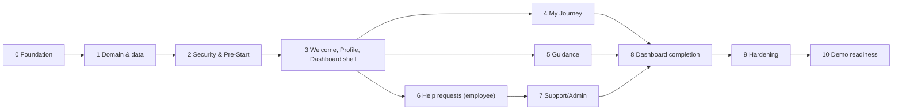

# BCX New Joiner Onboarding — Roadmap

| Item | Value |
|---|---|
| Document status | Draft v1.0 |
| Last updated | 07 October 2026 |
| Related | [ARCHITECTURE.md](./ARCHITECTURE.md) |

This roadmap breaks the MVP into small phases. Each phase ends with something that can be run and demonstrated, and does not start until the previous phase meets its exit criteria. Section references (for example "§8.5") point to [ARCHITECTURE.md](./ARCHITECTURE.md).

---

## Overview

| Phase | Name | Delivers | Requirements |
|---|---|---|---|
| 0 | Foundation | Repository, skeleton apps, Docker Compose, CI | NFR-6, NFR-7, NFR-10 |
| 1 | Domain model and demo data | Schema, entities, repositories, seed data | Basis for all |
| 2 | Security and Pre-Start Entry | Invitation and staff sign-in, JWT, guards | BR-1 |
| 3 | Welcome, Profile and Dashboard shell | Personalised first experience | BR-2 |
| 4 | My Journey | Phases, tasks, task completion | BR-2 |
| 5 | Guidance | Search, filter, articles | BR-3 |
| 6 | Ask for Help, My Requests, Request Details | Employee side of help requests | BR-4 |
| 7 | Support/Admin | Queue, assignment, lifecycle | BR-4 |
| 8 | Dashboard completion | Aggregated dashboard | BR-2, BR-3, BR-4 |
| 9 | Hardening | Responsive, accessibility, security, performance, coverage | All NFRs |
| 10 | Demo readiness | Demo script, README, demo scenarios | All |

Phases 4, 5 and 6 depend only on Phase 3 and can run in parallel if more than one developer is available.

---

## Definition of Done (every phase)

- Code follows the layering rules (§6.1, §7.1): no entities in API responses, no business logic in React components.
- Request DTOs are validated; errors use the RFC 7807 format (§7.5).
- New backend endpoints have unit tests for the service and web-layer tests for 2xx, 400, 401 and 403 where applicable.
- New frontend pages have React Testing Library tests for the main success path and the error state.
- Screens checked at the four reference viewports: 360×640, 768×1024, 1366×768, 1920×1080 (NFR-1).
- OpenAPI documentation is accurate for new and changed endpoints.
- No secrets, real BCX data or personal data in code, tests, fixtures or logs.
- CI is green; `docker compose up` still starts the whole system.
- Documentation updated if the design changed.

---

## Phase 0 — Foundation

**Goal:** an empty but correctly structured system that builds, tests and runs.

Deliverables:

- A dedicated git repository for this project (the folder currently sits inside a repository rooted at the home directory — risk RK-12), with `.gitignore`, `.gitattributes` and a `README.md` stub, pushed to GitHub.
- `backend/`: Spring Boot 3 / Java 21 / Maven project with the package structure from §12, `application*.yml` per profile, Actuator health, springdoc-openapi, `GlobalExceptionHandler` skeleton, correlation ID filter.
- `frontend/`: Vite + React + TypeScript project with MUI theme, React Router, shared Axios client, `AppShell` with responsive navigation (§6.4), placeholder pages, Vitest + React Testing Library setup, ESLint and Prettier.
- `docker-compose.yml` with `db` (PostgreSQL 16), `backend` and `frontend` (nginx with `/api` proxy), health checks, and a named database volume.
- `.env.example` with every variable from §7.6 and placeholder values.
- GitHub Actions workflow: backend build and tests, frontend lint, tests and build, Docker image build.

Exit criteria:

- `docker compose up` starts all three containers; `GET /actuator/health` returns `UP`; the browser shows the empty app shell at all four reference viewports.
- CI passes on the main branch.
- No secret values are committed; the backend refuses to start without `JWT_SECRET`.

---

## Phase 1 — Domain model and demo data

**Goal:** the complete data model with fictional demo data.

Deliverables:

- Flyway migrations for every table in §8.3, with constraints and indexes from §8.4, and the support request reference sequence.
- Reference data migrations: support teams, category routing (Appendix A.3), guidance categories and articles (A.5), task templates (A.4).
- JPA entities, enums (`OnboardingPhase`, `SupportRequestStatus`, `SupportCategory`, `TaskStatus`, `TaskOwnerType`, `StaffRole`), and repositories.
- `DemoDataSeeder` (`demo` profile only, idempotent): Sarah Mokoena, James Smith, demo staff (A.2), Sarah's invitation (hashed from `DEMO_INVITATION_CODE`), Sarah's tasks with calculated due dates, sample requests (A.6).
- Injected `Clock` with the `APP_DEMO_DATE` override (§7.7).

Exit criteria:

- Migrations run cleanly on an empty database; Hibernate `validate` passes.
- `@DataJpaTest` tests with Testcontainers cover custom queries and key constraints (unique Candidate ID, unique reference, one task per template per employee).
- Restarting the backend does not duplicate seed data.
- The database contains no plain-text invitation codes or passwords.

---

## Phase 2 — Security and Pre-Start Entry (BR-1)

**Goal:** secure sign-in for new joiners without a BCX account, and for demo staff.

Backend:

- `POST /api/v1/auth/pre-start` and `POST /api/v1/auth/staff` (§10.2).
- JWT issuing and validation with Spring Security OAuth2 Resource Server; claims as in §9.2.
- Security filter chain with role rules (§9.3), CORS from configuration, CSRF disabled for bearer tokens only.
- Per-invitation lockout, per-IP rate limiting, constant-time handling of unknown Candidate IDs, audit events (§9.1, §9.6).

Frontend:

- Pre-Start Entry page and Staff sign-in page.
- `AuthProvider`, token storage (§6.5), `RequireAuth` and `RequireRole` guards, 401 handling with "session expired" message, sign-out.

Exit criteria:

- FR-1.1 to FR-1.9 met.
- Tests prove: valid sign-in → 200; wrong code, unknown ID, expired, revoked and locked → 401 with an identical message; sixth consecutive failure for one Candidate ID → locked, still 401; more than `LOGIN_RATE_LIMIT_PER_MINUTE` attempts from one IP within a minute → 429; protected endpoint without a token → 401; wrong role → 403.
- Demo: sign in as Sarah on a phone-sized viewport; sign in as `lerato.dlamini` on desktop.

---

## Phase 3 — Welcome, Profile and Dashboard shell (BR-2)

**Goal:** a personalised first experience.

Backend:

- `GET /me/profile`, `PUT /me/welcome-acknowledgement`, first version of `GET /me/dashboard` (greeting, start date, days until start or day number, current phase, manager).
- `EmployeeDirectoryPort` with `LocalEmployeeDirectoryAdapter` (§11.1).
- Phase calculation in `OnboardingPhase` / `JourneyService` (§7.3).

Frontend:

- Welcome page (first sign-in redirect, then reachable from the menu).
- Profile page (read-only, "Something wrong? Ask HR" link, sign-out).
- Dashboard page with countdown, current phase and manager card.

Exit criteria:

- FR-2.1, FR-2.2, FR-3.1, FR-3.6, FR-10.1 to FR-10.3 met. (The "Ask HR" link points to `/help/new?category=HR`; that page arrives in Phase 6.)
- Unit tests cover every phase boundary in §7.3 (day 0, 1, 2, 30, 31, 60, 61, 90, 91).
- With today = 07 October 2026 the dashboard shows "26 days until Day 1"; with `APP_DEMO_DATE=2026-11-02` it shows "Day 1 of 90".

---

## Phase 4 — My Journey (BR-2)

**Goal:** the new joiner sees and works through their 90-day plan.

Backend:

- `GET /me/journey` with phase date ranges, phase state, tasks, `overdue` and `editableByMe` (§10.3).
- `PATCH /me/tasks/{taskId}`: only the owning employee, only `EMPLOYEE`-owned tasks (403 otherwise), optimistic locking (409).

Frontend:

- My Journey page: phase timeline (vertical on mobile, horizontal stepper on laptop and desktop), task list per phase, status control for editable tasks, overdue flag, link to the related guidance article.

Exit criteria:

- FR-4.1 to FR-4.6 met.
- Tests prove one employee cannot read or change another employee's task (404).
- Demo: mark "Read the new joiner welcome pack" as completed and see the progress change.

---

## Phase 5 — Guidance (BR-3)

**Goal:** the new joiner finds guidance about tools and ways of working.

Backend:

- `GET /guidance/categories`, `GET /guidance/articles` (search, category and phase filters, pagination), `GET /guidance/articles/{slug}`.

Frontend:

- Guidance page with search box, category and phase filters, and results list.
- Article page with safe Markdown rendering and an "Ask for help" link carrying a suggested category.

Exit criteria:

- FR-5.1 to FR-5.5 met.
- Searching "MFA" returns "Setting up multi-factor authentication on Day 1".
- Article bodies containing HTML or script tags are shown as text, not executed (test).

---

## Phase 6 — Ask for Help, My Requests, Request Details (BR-4, employee side)

**Goal:** the new joiner asks for help and follows progress.

Backend:

- `POST /requests` with validation, reference generation, routing through `category_routing`, first status history row, and a call to `ServiceManagementPort` (`MockServiceManagementAdapter`).
- `GET /requests` (open/closed filter, pagination), `GET /requests/{id}` with merged timeline, `allowedTransitions` and `canComment`.
- `POST /requests/{id}/comments` (moves `WAITING_FOR_EMPLOYEE` → `IN_PROGRESS`), `POST /requests/{id}/transitions` for withdraw, confirm and reopen.
- `RequestLifecyclePolicy` (§8.5) with exhaustive unit tests of allowed and rejected transitions.
- `NotificationPort` with `LoggingNotificationAdapter`.

Frontend:

- Ask for Help form (category pre-fill from query string), confirmation with reference and owning team.
- My Requests list (cards on mobile, table on laptop and desktop), open/closed filter.
- Request Details with owner, status, timeline, comment box and only the actions the API allows.

Exit criteria:

- FR-6.1 to FR-6.3, FR-7.1 to FR-7.3, FR-8.1 to FR-8.6 met.
- Tests prove: invalid input → 400 with field errors; another employee's request → 404; invalid transition → 409; internal comments never appear in employee responses.
- Demo: UJ-4 (§4) end to end.

---

## Phase 7 — Support/Admin (BR-4, staff side)

**Goal:** support staff own and progress requests.

Backend:

- `GET /support/requests` with filters; team scoping for `SUPPORT_AGENT`, all teams for `ADMIN`.
- `GET /support/requests/{id}`, `PUT /support/requests/{id}/assignment`, `POST /support/requests/{id}/transitions`, `POST /support/requests/{id}/comments` (public or internal), `GET /support/staff`, `GET /support/overview`.
- Assignment and transition rules from §8.5 (assignee required, comment required for `WAITING_FOR_EMPLOYEE` and `RESOLVED`).

Frontend:

- Support queue with filters and search, request detail with assign, status change and comment (public or internal) controls, overview counts for administrators.

Exit criteria:

- FR-9.1 to FR-9.6 met.
- Tests prove: an agent cannot see or change another team's request (404); only `ADMIN` can reassign across teams (403 otherwise); new joiners get 403 on every `/support/**` endpoint.
- Integration test and demo: UJ-5 (§4) end to end, with Sarah seeing every change.

---

## Phase 8 — Dashboard completion (BR-2, BR-3, BR-4)

**Goal:** the dashboard brings the whole experience together.

Backend:

- `DashboardService` adds journey progress, next 3 tasks, open request count, latest request, and up to 3 recommended articles for the current phase.

Frontend:

- Dashboard cards: countdown or day number, phase and progress, next tasks, requests summary, recommended guidance, manager. Grid of 1, 2 or 3 columns depending on breakpoint (§6.4).

Exit criteria:

- FR-3.1 to FR-3.6 met.
- Dashboard values match the Journey and My Requests pages for the same data (test).
- `GET /me/dashboard` meets the p95 < 500 ms target with demo data.

---

## Phase 9 — Hardening

**Goal:** meet every non-functional requirement.

Activities:

- Responsive pass on all pages at the four reference viewports, plus portrait and landscape tablet.
- Accessibility pass: keyboard-only walkthrough of all user journeys, component tests that query by role and accessible name (so missing labels fail the test), the Lighthouse accessibility audit in the browser, contrast check, screen reader spot-check (NVDA or VoiceOver).
- Security review against §9: dependency scan, header check, log review for personal data, token expiry and 401 handling, authorisation test matrix for every endpoint and role.
- Performance check: bundle size and route-level code splitting, API p95 with demo load, N+1 query check on list endpoints.
- Test coverage review: service-layer line coverage ≥ 80% (NFR-8); missing edge cases added.
- Content review: every name, email, article and team is fictional (RK-6).

Exit criteria:

- NFR-1 to NFR-14 verified, with results recorded in the pull request.
- No open high or critical findings.

---

## Phase 10 — Demo readiness

**Goal:** anyone on the team can run and present the MVP.

Deliverables:

- `README.md`: prerequisites, `cp .env.example .env`, `docker compose up`, URLs, demo credentials source (`.env`), how to run tests.
- Demo script covering UJ-1 to UJ-7 (§4), mapped to BR-1 to BR-4.
- Demo date scenarios using `APP_DEMO_DATE`: pre-start (`2026-10-07`), Day 1 (`2026-11-02`), first 30 days (`2026-11-20`), days 31–60 (`2026-12-15`), days 61–90 (`2027-01-20`).
- Architecture document updated with any decisions changed during build.

Exit criteria:

- A team member who did not build the system can start it from a clean clone and complete the demo script.
- Demo runs on mobile, tablet, laptop and desktop screens.

---

## After the MVP (not planned in detail)

Ordered by expected value. Each item uses the integration design in §11.

1. BCX SSO (OpenID Connect) for staff and for employees from Day 1; backend-for-frontend with `HttpOnly` cookies.
2. HR system integration for new-joiner records and automatic invitations, with a second factor for pre-start sign-in.
3. ITSM integration: ticket creation, status and comment synchronisation, transactional outbox.
4. Microsoft 365 notifications (email or Teams) and Day-1 calendar invitations.
5. LMS integration for training tasks.
6. Knowledge repository integration and full-text search for guidance.
7. Content management for guidance and journey templates; manager view; priorities and SLAs; attachments.
